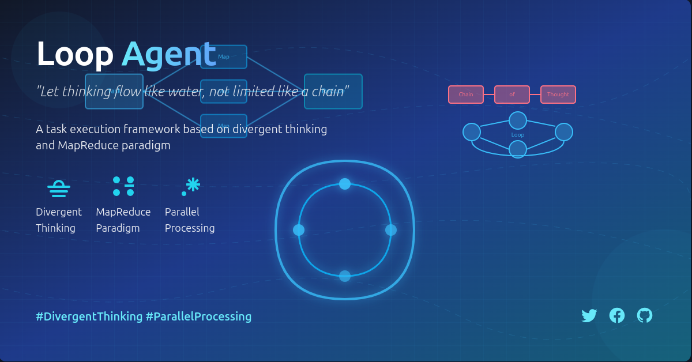

# Loop Agent - 基于发散思维的任务执行框架
*Loop Agent - 让思维如水般流动，而非如链般受限。*



## 核心理念

Loop Agent 拒绝传统的 Chain of Thought (COT) 思维链式推理模式，采用发散式思维结合 MapReduce 范式，实现更高效的任务处理流程。

### 拒绝 COT，拥抱发散思维

传统的 LLM 应用常采用 Chain of Thought (思维链) 方法，这种方法是线性的、顺序的推理过程。然而，人类实际思考过程往往是非线性的、发散的。Loop Agent 通过任务分解和并行处理，模拟人类更自然的思维模式。

### MapReduce 范式

我们的实现基于 MapReduce 理念：
- **Map 阶段**：将复杂任务拆分成多个独立子任务
- **执行阶段**：并行处理各子任务
- **Reduce 阶段**：整合各子任务结果，形成最终输出

## 实现方式

### 任务流程

1. 输入一个复杂任务
2. 通过 `TaskSplitter` 将任务分解为多个子任务
   - 分析任务描述和上下文
   - 识别独立的工作单元
   - 为每个子任务分配唯一ID
   - 确定子任务间的依赖关系
3. 通过 `RoleGenerator` 为每个子任务分配适合的执行角色
4. 使用 `TaskJxGenerator` 解析任务并创建执行计划
5. 通过 `execute_tasks` 函数处理各子任务
   - 根据依赖关系构建任务执行队列
   - 并行执行无依赖冲突的任务
   - 收集每个任务的执行结果和状态
   - 处理可能出现的任务失败情况
6. 使用 `TaskReducer` 整合各子任务结果
7. 生成结构化的最终输出
8. 以可视化方式展示任务执行流程和结果

## 系统流程图

### 整体工作流程


### 详细执行流程


### 任务依赖处理


### 关键组件

- **TaskSplitter**：负责任务分解，实现思维发散
- **RoleGenerator**：生成任务执行角色
- **TaskJxGenerator**：任务解析生成器
- **执行引擎**：并行处理各子任务
- **TaskReducer**：整合各子任务结果

## 优势

- **提高复杂任务处理能力**：通过分解降低单一任务的复杂度
- **并行思维模式**：更符合人类实际思考方式
- **结果更全面**：发散思维能够探索更多可能性
- **执行效率更高**：子任务可并行处理

## 使用方法

```python
from task.run import run

# 执行一个任务
results, execution_time = run("做一个 Linux 基础命令教学")

# 结果会保存在 output 目录下
```

## 项目结构

- `task.run.py`: 核心执行引擎
- `task_exect.py`: 任务执行模块
- `task_jx.py`: 任务解析模块
- `task_jx_excet.py`: 任务角色执行模块
- `tools/`: 工具函数集合
  - `task_splitter.py`: 任务分解工具
  - `llm_generatory.py`: LLM 调用接口
- `prompt/`: 提示词模板目录

## 扩展与优化

- 支持更复杂的任务依赖关系
- 优化子任务并行度
- 增强结果整合算法

---
````

