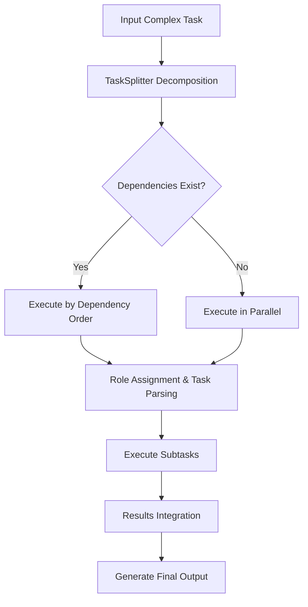
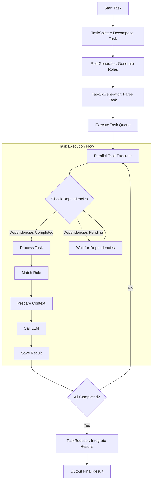
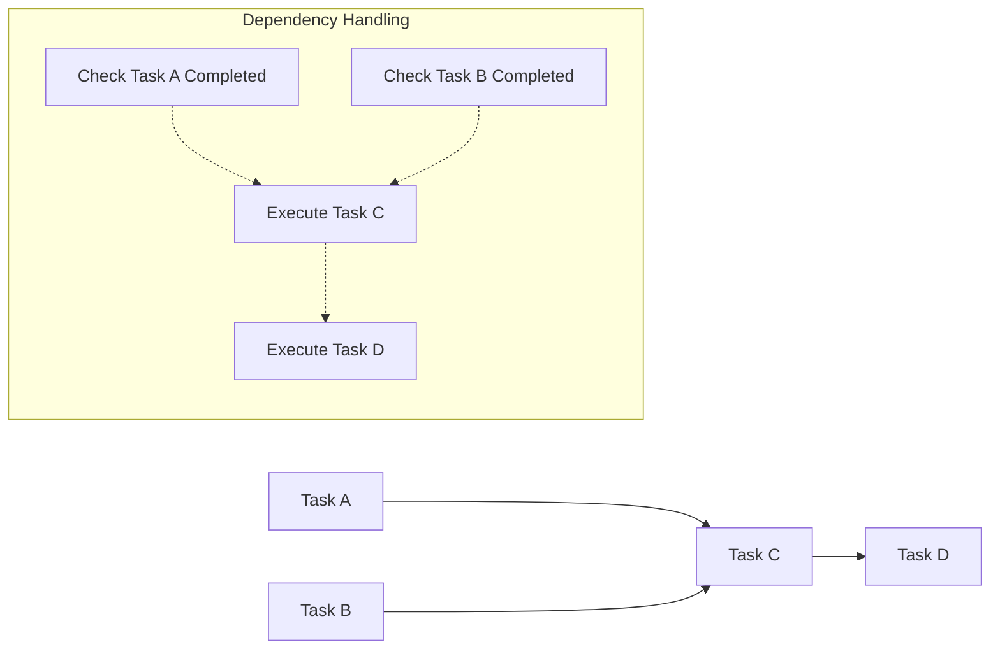

# Loop Agent - Task Execution Framework Based on Divergent Thinking

[English](#loop-agent---task-execution-framework-based-on-divergent-thinking) | [中文](./readme_zh.md)

*Loop Agent - Let thinking flow like water, not limited like a chain.*


## Core Concepts

Loop Agent rejects the traditional Chain of Thought (COT) reasoning pattern and adopts divergent thinking combined with the MapReduce paradigm to achieve a more efficient task processing workflow.

### Rejecting COT, Embracing Divergent Thinking

Traditional LLM applications often use the Chain of Thought method, which is a linear, sequential reasoning process. However, human thinking is often non-linear and divergent. Loop Agent simulates a more natural human thinking pattern through task decomposition and parallel processing.

### MapReduce Paradigm

Our implementation is based on the MapReduce concept:
- **Map Phase**: Breaking down complex tasks into multiple independent subtasks
- **Execution Phase**: Processing subtasks in parallel
- **Reduce Phase**: Integrating the results of various subtasks to form the final output

## Implementation

### Task Flow

1. Input a complex task
2. Use `TaskSplitter` to break down the task into multiple subtasks
3. Use the `execute_tasks` function to process each subtask
4. Integrate results and output

## System Flowchart

### Overall Workflow



### Detailed Execution Process



### Task Dependency Handling



### Key Components

- **TaskSplitter**: Responsible for task decomposition, implementing divergent thinking
- **RoleGenerator**: Generates roles for task execution
- **TaskJxGenerator**: Task parsing generator
- **Execution Engine**: Processes subtasks in parallel
- **TaskReducer**: Integrates the results of various subtasks

## Advantages

- **Enhanced Complex Task Processing**: Reduces complexity through decomposition
- **Parallel Thinking Mode**: More aligned with actual human thinking patterns
- **More Comprehensive Results**: Divergent thinking explores more possibilities
- **Higher Execution Efficiency**: Subtasks can be processed in parallel

## Usage

```python
from task.run import run

# Execute a task
results, execution_time = run("Create a Linux basic command tutorial")

# Results will be saved in the output directory
```

## Project Structure

- `task.run.py`: Core execution engine
- `task_exect.py`: Task execution module
- `task_jx.py`: Task parsing module
- `task_jx_excet.py`: Task role execution module
- `tools/`: Collection of utility functions
  - `task_splitter.py`: Task decomposition tool
  - `llm_generatory.py`: LLM calling interface
- `prompt/`: Prompt template directory

## Extensions and Optimizations

- Support for more complex task dependency relationships
- Optimization of subtask parallelism
- Enhanced result integration algorithms


