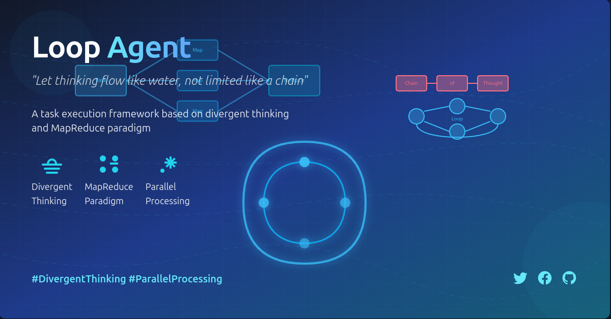
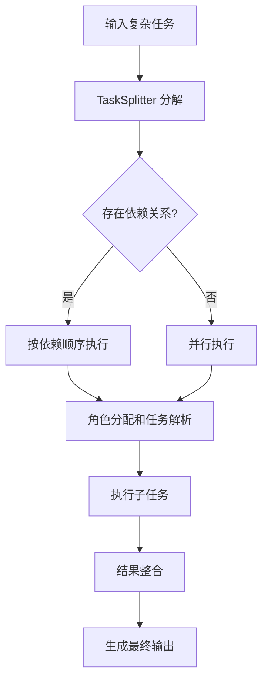
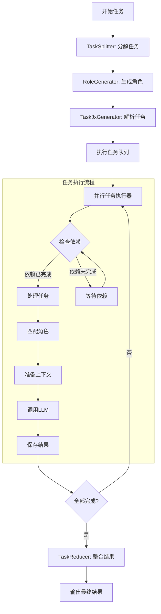
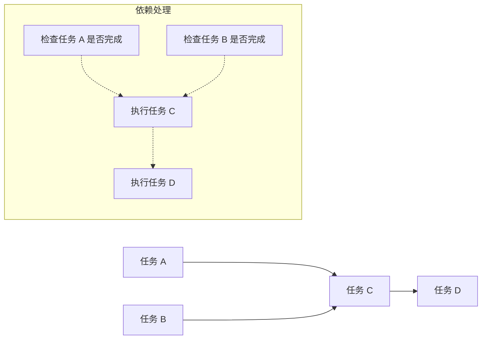

# Loop Agent - 基于发散思维的任务执行框架

[English](./readme.md) | [中文](#loop-agent---基于发散思维的任务执行框架)

*Loop Agent - 让思维如水流动，不受链式限制。*



## 核心概念

Loop Agent 抛弃了传统的思维链（Chain of Thought, COT）推理模式，采用发散思维结合 MapReduce 范式，实现更高效的任务处理工作流。

### 拒绝 COT，拥抱发散思维

传统的 LLM 应用通常使用思维链方法，这是一种线性、顺序的推理过程。然而，人类思维常常是非线性和发散的。Loop Agent 通过任务分解和并行处理模拟更自然的人类思维模式。

### MapReduce 范式

我们的实现基于 MapReduce 概念：
- **Map 阶段**：将复杂任务分解为多个独立子任务
- **执行阶段**：并行处理子任务
- **Reduce 阶段**：整合各子任务的结果形成最终输出

## 实现方式

### 任务流程

1. 输入复杂任务
2. 使用 `TaskSplitter` 将任务分解为多个子任务
3. 使用 `execute_tasks` 函数处理每个子任务
4. 整合结果并输出

## 系统流程图

### 总体工作流



### 详细执行过程



### 任务依赖处理



### 关键组件

- **TaskSplitter**：负责任务分解，实现发散思维
- **RoleGenerator**：生成任务执行角色
- **TaskJxGenerator**：任务解析生成器
- **执行引擎**：并行处理子任务
- **TaskReducer**：整合各子任务的结果

## 优势

- **增强复杂任务处理**：通过分解降低复杂度
- **并行思维模式**：更符合实际人类思维模式
- **更全面的结果**：发散思维探索更多可能性
- **更高的执行效率**：子任务可并行处理

## 使用方法

```python
from task.run import run

# 执行任务
results, execution_time = run("创建一个Linux基本命令教程")

# 结果将保存在输出目录中
```

## 项目结构

- `task.run.py`：核心执行引擎
- `task_exect.py`：任务执行模块
- `task_jx.py`：任务解析模块
- `task_jx_excet.py`：任务角色执行模块
- `tools/`：工具函数集合
  - `task_splitter.py`：任务分解工具
  - `llm_generatory.py`：LLM调用接口
- `prompt/`：提示模板目录

## 扩展与优化

- 支持更复杂的任务依赖关系
- 优化子任务的并行度
- 增强结果整合算法
